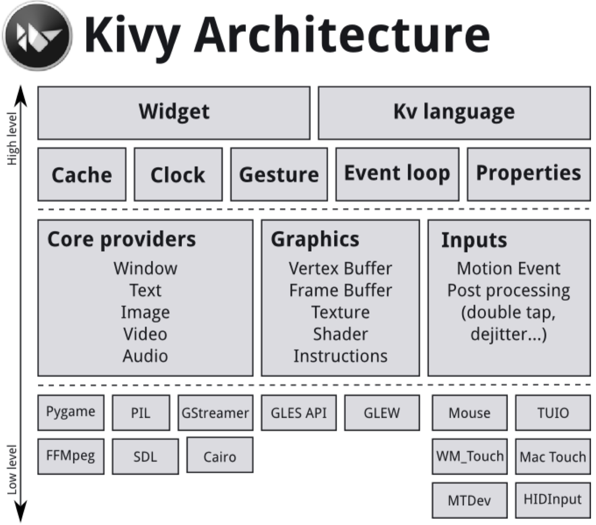
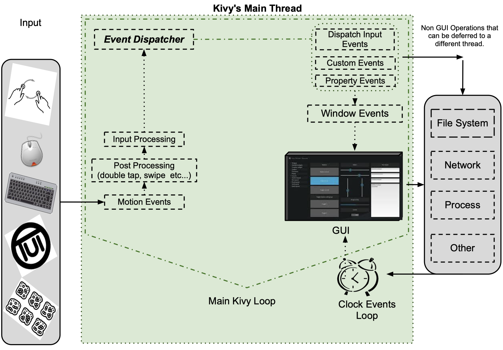

# Kivy Sutdy Notes

## Installation

### Installation on OSX

```shell
python -m pip install kivy

python -m pip install ffpyplayer
```

Make sure to set `KIVY_VIDEO=ffpyplayer` env variable before running the app. 

## Kivy Basics

Procedure of creating a kivy app:

- sub-classing the `App` class
- implementing its `build()` method so it returns a **Widget** instance (the root of your widget tree)
- instantiating this class, and calling its `run()` method.

A minimal app example is below:

```python
import kivy
kivy.require("1.11.1")
from kivy.app import App
from kivy.uix.label import Label

class MyApp(App):
    def build(self):
        return Label(text="Hello World")

if __name__ == "__main__":
    MyApp().run()
```

- It's required that the base class of your App inherits from the `App` class.
- The `unix` module holds the user interface elements like layouts and widgets.

```python
from kivy.app import App
from kivy.uix.gridlayout import GridLayout
from kivy.uix.label import Label
from kivy.uix.textinput import TextInput

class LoginScreen(GridLayout):
    def __init__(self, **kwargs):
        super(LoginScreen, self).__init__(**kwargs)
        self.cols = 2
        self.add_widget(Label(text="User Name"))
        self.username = TextInput(multiline=False)
        self.add_widget(self.username)
        self.add_widget(Label(text="password"))
        self.password = TextInput(password=True, multiline=False)
        self.add_widget(self.password)

class MyApp(App):
    def build(self):
        return LoginScreen() 

if __name__ == "__main__":
    MyApp().run() 
```

- we define a root widget class `LoginScreen` inheriting `GridLayout`
- in the `init` method of `LoginScreen` we need call its superclass's `init` method firstly

## Controlling the environment

kivy 使用了很多外部的 package 来创建 App，而不是把所有的功能都自己实现。这样 kivy 内包含了很多的**环境变量**来保存 kivy 外部 package 的配置。在 kivy 程序的开头，我们可以根据需要，对这些**环境变量**进行部分修改。比如，将 kivy app 中的文字渲染机制改为基于 PIL 实现，如下。

```python
import os
os.environ['KIVY_TEXT'] = "pil"
import kivy
...
```

### ENV VARs for path control

- `KIVY_DATA_DIR`: Location of the kivy data, defaults to *kivy-path/data*
- `KIVY_MODULES_DIR`: Location of the Kivy modules, defaults to *kivy-path/modules*
- `KIVY_HOME`: Location of the Kivy home. This directory is used for local configuration, and must be in a writable location.
- `KIVY_SDL2_PATH`: If set, the SDL2 lib and headers from this path are used when compiling kivy instead of the ones installed system-wide. To use the same libraries while running a kivy app, this path must be added at the start of the *PATH* environment variable.

### ENV VARs for configuration management

- `KIVY_USE_DEFAULTCONFIG`: If this name is found in environ, Kivy will not read the user config file.
- `KIVY_NO_CONFIG`: if set, no configuration file will be read or written to. This also applies to the user configuration directory.
- `KIVY_NO_FILELOG`: If set, logs will be not print to a file
- `KIVY_NO_CONSOLELOG`: If set, logs will be not print to the console.
- `KIVY_NO_ARGS`: If set, the argument passed in command line will not be parsed and used by Kivy.

### ENV VARs restrict core to specific implementation

`kivy.core` try to select the best implementation available for your platform. For testing or custom installation, you might want to restrict the selector.

- `KIVY_WINDOW`: Implementation to use for creating the window, e.g. `sdl2`, `pygame`, `x11`, `egl_rpi`
- `KIVY_TEXT`: Implementation to use for rendering text, e.g. `sdl2`, `pil`, `pygame`, `sdlttf`
- `KIVY_VIDEO`: Implementation to use for rendering video, e.g. `gstplayer`, `ffpyplayer`, `ffmpeg`, `null`
- `KIVY_AUDIO`: Implementation to use for playing audio, e.g. `sdl2`, `gstplayer`, `ffpyplayer`, `pygame`, `avplayer`
- `KIVY_IMAGE`: Implementation to use for reading image, e.g. `sdl2`, `pil`, `pygame`, `imageio`, `tex`, `dds`, `gif`
- `KIVY_CAMERA`: Implementation to use for reading camera, e.g. `avfoundation`, `android`, `opencv`
- `KIVY_SPELLING`: Implementation to use for spelling, e.g. `enchant`, `osxappkit`
- `KIVY_CLIPBOARD`: Implementation to use for clipboard management, e.g. `sdl2`, `pygame`, `dummy`, `android`

### Metrics

- `KIVY_DPI`: If set, the value will be used for `Metrics.dpi`
- `KIVY_METRICS_DENSITY`: If set, the value will be used for `Metrics.density`
- `KIVY_METRICS_FONTSCALE`: If set, the value will be used for `Metrics.fontscale`

### Graphics

- `KIVY_GL_BACKEND` The OpenGL backend to use.
- `KIVY_GL_DEBUG` Whether to log OpenGL calls
- `KIVY_GRAPHICS` Whether to use OpenGL ES2.
- `KIVY_GLES_LIMITS` Whther the GLES2 restrictions are enforced.
- `KIVY_BCM_DISPMANX_ID` Change the default Raspberry Pi display to use.
- `KIVY_BCM_DISPMANX_LAYER` Change the default Raspberry Pi dispmanx layer.

## Architectural Overview




### 中间层

Kivy 将需要调用操作系统或底层程序API的 Task，称为 core task，比如打开一个窗口，显示文字或图像，播放声音，获取摄像头图像。Kivy 对这些 core task 实现方式进行抽象，即你只需要调用 core provider 中提供的代码，就可以完成 core tasks。这样，core provider 就是一个中间层，给 kivy App 和操作系统提供了沟通的桥梁。类似地，input provider 是 kivy app 与 各种不同输入外设之间的通信中间层。

> A piece of code that uses one of these specific APIs to talk to the operating system on one side and to Kivy on the other (acting as an intermediate communication layer) is what we call a core provider.

Kivy Graphics API 提供了对 OpenGL 的功能抽象，让 kivy App 可以容易地使用 GPU 对矢量图形进行渲染。


###Kivy core

 Kivy core package 提供了如下一些功能模块：

- **Clock**： You can use the clock to schedule timer events.
- **Cache**: If you need to cache something that you use often, you can use this class.
- **Gesture Detection**: You can use it to detect various kinds of strokes, such as circles or rectangles. You can train it to detect your own strokes.
- **Kivy Language**: used to describe user interface easily and efficiently.
- **Properties**: Kivy's own property classes that link your widget code with user interface description.


### UIX (Widgets & Layouts)

- **Widgets** are user interface elements that you add to your program to provide some kind of functionality. They may or may not be visible. Examples would be a file browser, buttons, sliders, lists etc. Widgets receive MotionEvents.
- **Layouts** are used to arrange widgets, such as GridLayout and BoxLayout. You can also nest layouts.


### Input Events (Touches)

对于多数的 input types and sources，你都可以从它们的 input events 获取 2D onscreen-position。（但也有一些 inputs 例外，如加速度计。）这些 input types 在 kivy 中表示为 `Touch` class 的实例。一个 `Touch` 实例有三种输入状态（如下）。当一个 touch 进入其中一个状态，就会触发 event。

- **Down**: A touch is down only once, at the very moment where it first appears.
- **Move**: T touch can be in this state for a potentially unlimited time.
- **Up**: A touch goes up at most once, or never.


### Widgets and Event Dispatching

The term *widget* is often used in GUI programming contexts to describe some part of the program that the user interacts with. In Kivy, a widget is an object that receives input events. It does not necessarily have to have a visible representation on the screen. All widgets are arranged in a *widget tree*, and there is exactly one *root widget*.

*Widget 可以接收 input event 并作出相应动作。*

When new input data is available, Kivy sends out one event per touch. The root widget of the widget tree first receive the event. Depending on the state of the touch,  the `on_touch_down`, `on_touch_move`, or `on_touch_up` is dispatched to the root widget, which results in the root widget's corresponding event handler being called.

Each widget (including the root widget) in the tree can choose to either digest or pass the event on. If an event handler returns True, it means that the event has been disgested and handled properly. Otherwise, the event handler passes the event on to it own children.

*当 sensor 产生新的数据输入时，kivy 就会生成一个对应的 input event (Touch class instance)，并 dispatch 给 root widget。每个 widget 接收到 input event 后，都可以选择处理掉它或者传递给其 children widgets。如果选择处理，widget 会调用与 event type 对应的 event handler 方法来处理，处理结束返回 `True`，否则 event 就自动传递给 children widgets。*

Often times, you will want to restrict the area on the screen that a widget watches for touches. You can use a widget's `collide_point()` method to achieve this. By default, this checks the rectangular region on the screen that's described by the widget's pos and size.  

*一个 widget 在屏幕上表示为一个矩形区域，通常 widget 只处理发生在自身范围内的 input event。具体过程是，widget 使用 `collide_point()` 方法来检查 event 的 onscreen-position 是否在自己的区域内。如果是则处理并返回 True，否则返回 False。*


## Events and Properties



### Main Loop

每个 Kivy App 都有一个 main loop, 它维护着 App 运行期间的所有事务，包括 handle events, update states, and redraw widgets。在每个 main loop iteration 内，都会处理 event queue 内的所有 events，即调用 events 绑定的 callbacks。

### Event Dispatcher

前面讲到 Kivy 系统自身可以根据用户的输入产生对应的 input event (Touch instance)，然后将 Touch instance 传递给 widget tree，当 touch instance 的 onscreen-position 落在某个 widget 的范围内，该 widget 对应的 callback 处理这个 input event, 并返回 True。

上面的 event source 是 sensor 输入，但程序员也可以创建自定义的 event source 即 `EventDispatcher`。在 custom EventDispatcher 内你可以 register custom event type，定义 dispatch 方法和 callback 方法。另外 kivy 还有其他一些预定义的 EventDispatcher e.g. `Widget`, `Animation`, `Clock`。

#### Clock schedule events

```python
def my_callback(dt):
  print("My callback is called", dt)
  
event = Clock.schedule_interval(my_callbackm, 0.5)
```

上面的代码首先定义了一个 callback 函数，然后使用 Clock 创建一个周期性的 event，并将 前面的 callback 函数绑定到这个 event 上，最后设定了触发周期。这样的效果相当于每 0.5 秒调用 callback 函数一次。（应用例子：游戏中的坦克周期性地发射炮弹）

```python
event.cancel()  # or
Clock.unschedule(event)
```

上面两条语句都可以停止 event 的周期性触发。另外如果 callback 函数可以条件性的返回 False，这样 Clock repetitive event 也可以自动停止触发。如下

```python
count = 0
def my_callback(dt):
  global count
  count += 1
  if count>=10:
    print("Last call of my callback, bye bye")
    return False 
  else:
    print("My callback is called")
    
Clock.schedule_interval(my_callback, 0.5)
```


你也可以使用 Clock 来触发一次性 event。比如游戏角色死了，就可以触发一个一次性 event。

```python
def my_callback(dt):
  print("My callback is called")
  
Clock.schedule_once(my_callback, 1)
```

`schedule_once` 的第二个参数 `x` 触发延迟，即多久之后触发。下面是一些可能的取值：

- `x > 0`，callback 将在 `x` 秒后被调用
- `x == 0`, callback 将在 redraw next frame 之后调用
- `x == -1`, callback 将在 redraw next frame 之前调用

`create_trigger` 和 `schedule_once` 类似，用来触发一次性事件来执行某个 callback，但有一个细微差别，`create_trigger` 保证在两帧之间只会触发一次该事件。

```python
trigger = Clock.create_trigger(my_callback)
# later
trigger()
```

#### Create custom event dispatcher

如果你想创建一个独立的自定义的 event dispatcher，可以通过如下方式：

- 创建一个 event dispatcher class 继承 `EventDispatcher`
- 在 `init()` 中注册一个 event type
- 定义一个与 event type 同名的 callback，这样这个 callback 会自动绑定到前面的 event type
- 定义一个 method 来 dispatch 该类型的一个 event

```python
class MyEventDispatcher(EventDispatcher):
  def __init__(self, **kwargs):
    self.register_event_type("on_test")
    super(MyEventDispatcher, self).__init__(**kwargs)
    
  def do_something(self, value):
    # when called, the `on_test` event will be
    # dispatched with the value
    self.dispatch("on_test", value)
    
  def on_test(self, *args):
    print("I am dispatched", args)
    
ep = MyEventDispatcher()
```

其实我们使用 `ep.do_something()` 的执行效果等于 `ep.on_test()`，区别在于使用 Event dispatch 机制相当于先在 event queue 预定一次 `ep.on_test` 方法的执行，让给 main loop 在处理 event queue 的时候执行。而直接调用 `ep.on_test()` 是即刻执行。

通常我们像上面那样将一个 event 相关的 register, dispatch, handle 等代码放在一个类中。但我们也可以将 dispatch 和 handle 的代码分开，同时使用显示的方式将一个 callback bind 到一个 event type 上。

我之前在写一个 GUI App 时就出现了这样的需求，即在一个子模块中按下一个 button，其 callback 需完成一个几个模块协同的工作。这时候就要将 callback 定义在主模块中，并在主模块中显式地 bind。

```python
def my_callback(*args):
  print("Hello, I got an event!", args)
  
ep = MyEventDispatcher() 
ep.bind(on_test=my_callback)
ep.do_something("he", "llo")
```

执行上面的代码，会得到如下结果：

```
Hello, I got an event! (['he', 'llo'],)
I am dispatched (['he', 'llo'],)
```

因为我们将两个函数 (`on_test`, `my_callback`) 绑定到了 `on_test` event type，所以 on_test event 触发后两个 callbacks 都会被执行。并不会出现一个 callback override 另一个 callback 的情况。

#### Widget Events

一个 widget 通常有两种类型的 event：

- **Property event**：与 widget 自身属性相关的 event，比如你改变了一个 widget 的位置或大小，对应的 property event 就会被触发。
- **Widget-defined event**：与 widget 功能对应的 event，比如你按下一个 button 就会触发对应的功能。

Widget-defined event 通常对应于 `on_touch_down`, `on_touch_move`, `on_touch_up` event types，你需要在 widget 定义中 绑定或重载对应的 callback 方法。而 Property event 比较特别，下面详细说明。

通过 property event 你可以给 widget 的某个属性绑定特定的 callback，当这个属性值发生变化了，就会触发对应的 property event。property 包括如下一些类型：

- StringProperty
- NumericProperty
- BoundedNumericProperty
- ObjectProperty
- DictProperty
- ListProperty
- OptionProperty
- BooleanProperty
- ReferenceListProperty

##### 声明一个 Property

Property 可以理解成特殊的 attribute，需要声明在 class level，但在实例化过程中会自动生成对应的 instance attribute。

```python
class MyWidget(Widget):
  text = StringProperty("")
  
  def __init__(self, **kwargs):
    super(Mywidget, self).__init__(**kwargs)
```

##### Property Callback

Property 触发的 event type 为 `on_<property_name>`，你可以定义一个对应的同名方法，这样这个方法就自动绑定到 property event 上了。

```python
calss CustomBtn(Widget):
  pressed = ListProperty([0, 0])
  
  def on_touch_down(self, touch):
    if self.collide_point(*touch.pos):
      self.pressed = touch.pos
      return True 
    else:
      return super(CustomBtn, self).on_touch_down(touch)
    
  def on_pressed(self, instance, pos):
    print("pressed at {pos}".format(pos=pos))
```

当然你也可以将 property callback 定义在 widget 之外，然后显示地 bind callback。下面是一个比较综合的例子。

```python
from kivy.app import App
from kivy.uix.widget import Widget
from kivy.uix.button import Button
from kivy.uix.boxlayout import BoxLayout
from kivy.properties import ListProperty

class RootWidget(BoxLayout):
  def __init__(self, **kwargs):
    super(RootWidget, self).__init__(**kwargs)
    self.add_widget(Button(text='btn 1'))
    cb = CustomBtn()
    cb.bind(pressed = self.btn_pressed)
    self.add_widget(cb)
    self.add_widget(Button(text="btn 2"))
    
  def btn_pressed(self, instance, pos):
    print("pos: printed from root widget: {pos}".format(pos=pos))
    
class CustomBtn(Widget):
  pressed = ListProperty([0, 0])
  
  def on_touch_down(self, touch):
    if self.collide_point(*touch.pos):
      self.pressed = touch.pos
      # we consume the touch. return False here to propagate
      # the touch further to the children
      return True
    else:
      return super(CustomBtn, self).on_touch_down(touch)
    
  def on_pressed(self, instance, pos):
    print("pressed at {pos}".format(pos=pos))
    
class TestApp(App):
  def build(self):
    return RootWidget() 
  
if __name__ == "__main__":
  TestApp().run() 
```


## Input Management


